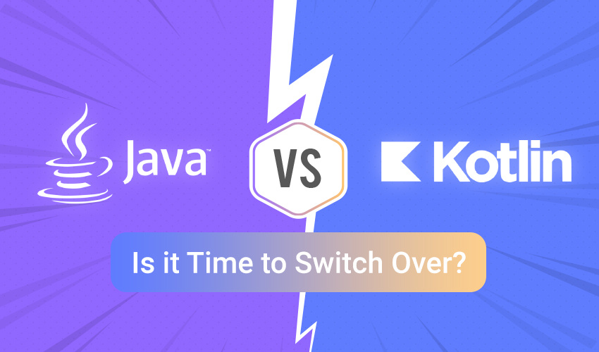

If you're a mobile app developer,Java is probably your go-to launguage for building mobile apps.
But their are many new launguage that popping up all over the place that are now challenging the java
kingdom in the android world.

One of the major launguage is kotlin,a new programing launguage which has already being announced by the google as the official launguage in android development.

Kotlin is rapidly gaining popularity among new android application developer.Although, it is constantly being developed and improved. 

### What is Kotlin?

Kotlin was designed by the legend programmers from **JetBrains** (the guys who are behind the all integrated development environments like pycharm,itelliJ and even Android Studio).

Kotlin has gained its popularity after being announced as an official launguage for android at **Google I/O in 2018**.As google also switched its major documentation regarding android development to Kotlin.

As Kotlin is a open source launguage,which is based on jvm(java virtual machine),due to its open source environment the codebase of kotlin is improving rapidly,as new features are adding day by day.

> So ,meanwhile if someone wants to know what are Open Source Projects or How to contribute to Open Source repos? Then Checkout this awesome 👉 [How to get started with Open Source?](https://www.hackerearth.com/getstarted-opensource/).

### Pros of Kotlin

- Switching from Java to Kotlin - just you have to install kotlin plugin,and add it to your Gradle Build Scripts.

- It support morder android architecture as many android developers tend to follow a fixed project structure which is MVVM(Model--> View--> ViewModel-->repository ) or Model–view–presenter (MVP) which is a derivation of the model–view–controller (MVC) architectural pattern.

- **Kotlin coroutines** is one of the major feature of kotlin,Coroutines are one of the best replacement of AsyncTasks which are now deprecated by the google in android studio.

- Kotlin support's **mordern programing concepts** like extension function,Higher order fuction like lambdas.

- **Retrofit2** has a great support for kotlin which can be used to make a clean Api's call and making Http request.

- Kotlin provides a **built-in null safety** support like you will get rid of null pointer exception.

- Devs can also get benefit from a rapidly growing collection of open source projects on GitHub, many books, learning resources, and online courses.

- Kotlin does not cost you much it's just require training and time.

### Cons of Kotlin

- One of the major con's of kotlin is smaller developer circle or community as compared to java which is a industry launguage.

- Kotlin is a **declarative launguage** sometimes it led's to create a lot of unwanted boilerplate code as compare to java.

- Slower compilation speed than java.

### Why use Kotlin for Android?

You may question--**Why to switch from java to kotlin?**

As one of the main point to make a jump in 2020 is kotlin is made to recover the issues of java.It means that Kotlin provides many safety mechanisms available out-of-the-box while being more concise and expressive than Java at the same time.

And according to stackoverflow kotlin is one of the favourite launguage among developer's.

Credit: [“Developer Survey Results 2019” by Stack Overflow](https://insights.stackoverflow.com/survey/2019)

### Conclusion

While Kotlin offers many advantages that Java doesn’t, it still has some shortcomings,but if you're a beginner and frustrated from declaring long syntax even for printing a statement in java and need a shortcut then kotlin will the best way to enhance your code.

