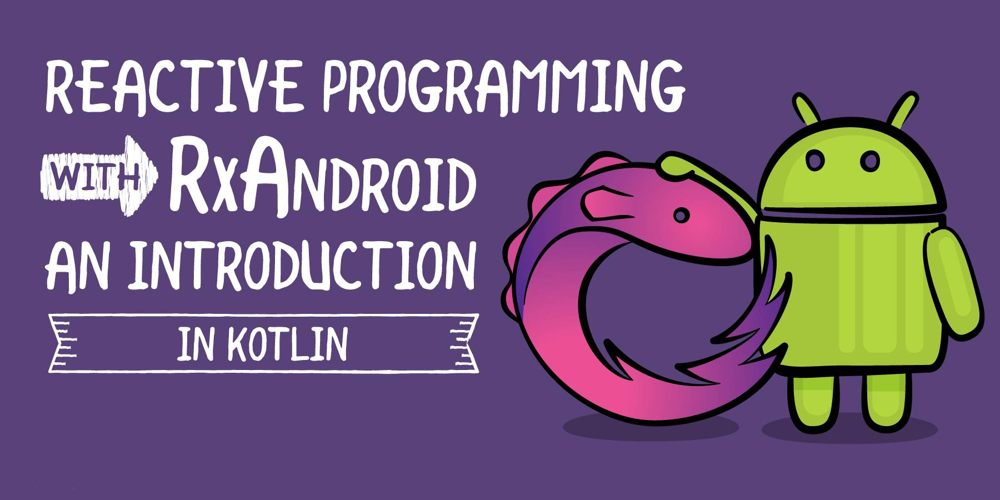

Reactive programing provides a solid foundation towards creating scalable android application.As their are another ways also to create a scalable application like Kotlin Coroutines.But one of the best way is Rxjava/Rxkotlin in Android Application Development.

### What's Rxjava?
Rxjava is a reactive programming library for composing **asynchronous and event-based programs** by using observable sequences.

Reactive Programing is based on data stream and propgation of changes.Reactive Programming is one of the easier way to express the static such as arrays very easily.

Let me explain the lines with a simple story,let say Ankita is a KFC cashier and his manager thinks that she is stealing some money now a days.So he asked Param to keep an eye on him and reports back to him on everything she does.

One day Param founded that Ankita is stealing some money and also gave some wrong change back to the customer's.

Param being a good employee,he reported back to the manager immediately as the event took place.

In this situation, Param is the Observer and Ankita is the data. Param was told to watch and report Ankita as her state changes, and he’s to make a callback to whoever is listening to him (the manager).




### Where you can use Rxjava or RxKotlin?

- Network Calls such as Api's call using retrofit2 Http request ,this fully supports Rxjava.
- UI events that should trigger action.

### How to make Api's Reactive using RxKotlin?

Frist of all let's add some dependencies in build.gradle in your project 👇 and if you're not familiar with retrofit2/okhttp and how to make an http request?.Then you can go through this article 👉 [Understand How does Retrofit work?](https://medium.com/mindorks/understand-how-does-retrofit-work-c9e264131f4a).
**NOTE**: MainActivity.xml only contain's two component's Textview and Circular Progress View,As we will only about the functionality of Retrofit2,Api's and Rxjava/Rxkotlin majorly in this blog.

#### Dependencies

``` kotlin

    implementation 'io.reactivex.rxjava2:rxkotlin:2.4.0'
    implementation 'io.reactivex.rxjava2:rxandroid:2.1.1'
    implementation 'com.squareup.retrofit2:retrofit:2.8.1'
    implementation 'com.squareup.retrofit2:converter-gson:2.8.1'
    implementation 'com.squareup.retrofit2:adapter-rxjava2:2.8.1'
```
To get a well understanding of RxKotlin/RxAndroid,We are going to build a Sample Project using Retrofit2 and RxKotlin.The Retrofit2 is used to call a **TimeApi** in this project which will show the unix time in the textview,So till now we have added dependencies,And now let's get understand the project structure.

I usually follow MVVM pattern or architecture you are free to use any pattern/architecture😁,So we will first create a **Network Package** into it we will create two files one is interface and the other one is a singleton object or class in kotlin.

#### Interface  👉 TimeApi.kt

``` kotlin

interface TimeApi {

    @GET("api/timezone/Europe/London")//Endpoint of the Url
    fun getTime() :Observable<Time>

}

```
So, we have done with creating interface for making a **Get Request**(@GET) for the Api so that we can fetch the **Json** data.Now we will create a Client.kt (Singleton object or class)which will create Retrofit builder and parse the data from **Json --> Java Object**.As kotlin has one great feature which is object class by declaring object as a keyword you can create class and instance of it at the same time of it declaration.

 Then we will create Rxjava2calladapterfactory, which will create and setup Rxjava/RxKotlin env.

### Builder Class 👉 Client.kt

``` kotlin

//http://worldtimeapi.org/ + api/timezone/Europe/London.txt (DATA SOURCE)

object Client {  

   private val retrofit = Retrofit.Builder()//Builder
        .addConverterFactory(GsonConverterFactory.create())//Converting json to java objects
        .addCallAdapterFactory(RxJava2CallAdapterFactory.create())//Setup the Rxjava
        .baseUrl("http://worldtimeapi.org")//Base URL
        .build()

   private val timeApi = retrofit.create(TimeApi::class.java)

    val time = timeApi.getTime()

}

```

So,we have setup our Network module's and now we have to create a **Modal Package** which is simply a POJO class or a Dataset. From that place we can pick up any data which should be shown in textview,So for this project we will fetch the unix time from that data.So,in kotlin we can create a data class by simply declaring a **data Keyword(Kotlin Smart in-built feature).**

#### Data Class or POJO Class

``` kotlin

data class Time(val unixtime:String)

```

A simple hack to generate the POJO Class is to use **Robopojo Generator**.It is a plugin where you only need to paste the json data then it will automatically converts it to the POJO Class. 


After creating a Data Class we have done with Modal module.So,Now we have to create a **View Package** as the name say's view is something which is related to view of our android app in this package we will simply put our MainActivity.kt and call the Retrofit and Rxjava method's.So,lets see How it can be done?

#### MainActivity.kt

``` kotlin

class MainActivity : AppCompatActivity() {

    override fun onCreate(savedInstanceState: Bundle?) {
        super.onCreate(savedInstanceState)
        setContentView(R.layout.activity_main)

        prglay.visibility = View.VISIBLE//This is simply a circular progress view which tell us the   data is fetched or not. 


        time.subscribeOn(Schedulers.io())//Frist the person should subscribe the thread.

            .observeOn(AndroidSchedulers.mainThread())//As soon as the thread is subscribed the the observer will observe the information and get the notification as the data changes, similar to Youtube

            .repeatWhen { complete->complete.delay(2,TimeUnit.SECONDS) }//This is simply a time delay sys which will repeat the whole process once the user subscribe to main thread.

            //Implementing the methods of Rxjava
            .subscribe(object: Observer<Time>{
                override fun onComplete() {
                    Log.e("MainActivity","Completed")
                }

                override fun onSubscribe(d: Disposable) { 
                //Once the user subscribed the mainthread he will start getting the info which is the unixtime.

                    Log.e("MainActivity","Subscribed")

                }

                override fun onNext(t: Time) { //After subscription is passed the info will be displayed and process is completed.

                  prglay.visibility= View.INVISIBLE
                    txtv.text = t.unixtime

                }

                override fun onError(e: Throwable) {

                }
            })


    }
}

//The view of our android app is ready😃!!!

```

So,now our project is ready to run and build.But before running don't forget to add **INTERNET_ACCESS** permission in the **Android Manifest.xml**

#### Android Manifest.xml

``` kotlin

<uses-permission android:name="android.permission.INTERNET"/>

```

**The above code can be generalized and can be used for 80% of network's call and request.As in this project you can also use Kotlin Coroutines in the place of Rxjava which is also a best alternative for AsyncTask's.I hope you will get most out of this project,as it is one of the most easier way to use Rxjava/Rxkotlin in android.**😁 


                                    


